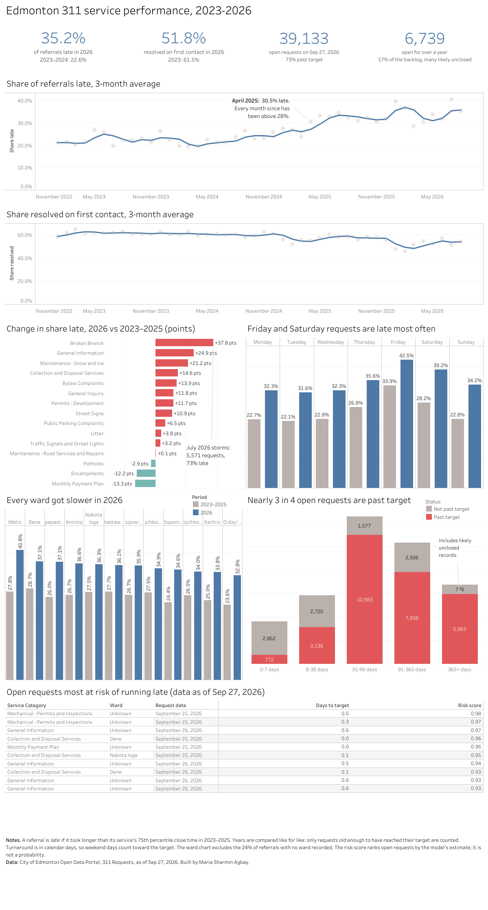

# Edmonton 311 Service Request Performance

**Live dashboard:** [Tableau Public](https://public.tableau.com/app/profile/maria.sharmin.agbay/viz/Edmonton311ServicePerformance)  |  **Tools:** Python, PostgreSQL, SQL, scikit-learn, Tableau



End-to-end analysis of **3,446,386** City of Edmonton 311 requests (January 2023 to September 2026): Python extraction, PostgreSQL staging and summary tables, automated data checks, a model that ranks open requests by their risk of running late, and a dashboard. The whole pipeline rebuilds with one command.

## The question

A service manager asked for a clearer view of how 311 requests flow through the City: how many come in each month and for which services, which take longest to close, how big and how old the open backlog is, how wards compare, and whether a new request can be flagged early as likely to miss its target. Everything had to refresh from the latest data with a single command.

## Key findings

1. **Requests passed to City departments are running late more often, and the slowdown began in spring 2025.** Comparing like for like, the share of referrals that were late was 22.8% in 2023, 22.4% in 2024, 30.8% in 2025 and 35.2% in 2026: about 1 in 3 now, against about 1 in 4.5 two years ago. The break is clean: every month from April 2025 on was above 28% late, while no earlier month was above 27.5%.
2. **Fewer requests are resolved on first contact.** The share 311 resolved without passing on fell from 61.5% (2023) to 51.8% (2026). Counting on-the-spot answers logged as referrals gives the same decline, so it is not a change in how requests are recorded.
3. **Most of the busiest services got slower, but not all.** Of the 15 busiest services, 12 were late more often in 2026 than in 2023–2025. Broken Branch rose most (+37.8 percentage points), much of it from the surge after the July 2026 storms (5,571 requests in July, 73% late); its other 2026 months together were still 49% late. General Information (+24.9) and Snow and Ice maintenance (+21.2) followed, and Bylaw Complaints went from 25.7% to 39.7%. Three improved: Monthly Payment Plan (−13.3 points), Encampments (−12.2) and Potholes (−2.9).
4. **It is citywide.** Every ward got worse, from 24–29% late in 2023–2025 to 33–41% in 2026. The gap between wards (about 8 points) is smaller than the rise they all share.
5. **Friday and Saturday requests are late most often.** In 2023–2025, 33.9% of Friday and 28.2% of Saturday requests were late, against 22–23% for Monday to Wednesday; in 2026, 42.5% and 39.2% against about 32%. Sunday requests are no worse than midweek ones, which is consistent with weekend days counting toward the target.
6. **The model helps prioritise but does not predict individual requests.** If crews checked the riskiest 20% of requests first, they would catch 37.5% of the late ones, against 20% by chance (ROC AUC 0.738).

## How "late" is defined

The data has no target field, and services run on very different clocks (Bylaw Complaints take a median of 13 days; many requests close the same day). So a closed referral is **late if it took longer than the 75th percentile of its own service category**, with thresholds set from 2023–2025 requests and applied to every year. Three refinements keep it fair:

- **Like-for-like comparisons.** A request only counts once it has existed longer than its category's target, so recent requests are not counted as "on time" just because they are new. Open requests already past their target count as late.
- **Instant-close categories are left out.** In 51 categories, at least 75% of referrals close within 15 minutes (for example, Lost and Found), so their close times record admin, not service work.
- **Small categories** (under 500 requests in 2023–2025) use the overall 75th percentile instead of their own.

## How it works

```
City of Edmonton API ──> raw.requests ──> staging.requests ──> marts.* ──> CSV ──> Tableau
     (extract.py)        (as delivered)    (02_staging.sql)   (03_marts.sql)  (export.py)
                                                  │
                                         checks.py, model.py
```

1. **Extract** (`src/extract.py`): streams the dataset from the City's open data API in pages of 50,000 rows into PostgreSQL.
2. **Transform** (`sql/02_staging.sql`, `sql/03_marts.sql`): types and cleans every row, flags data issues, sets each category's late threshold, then builds small summary tables, one per question.
3. **Check** (`src/checks.py`): 11 automatic checks; the run stops before the model if any fail.
4. **Model** (`src/model.py`): trains on earlier years, tests on 2026, and scores open requests by risk.
5. **Export** (`src/export.py`): seven CSV files (about 2 MB) for the dashboard.

## The model

A gradient-boosted classifier (`HistGradientBoostingClassifier`) predicts whether a referral will be late, using only what is known when the request is made: service category and description, service area, channel, ward, neighbourhood, and the month, weekday and hour it came in.

It is trained on earlier years and tested on 323,581 requests from 2026 (35.2% late). Two training periods were compared:

| Measure | Trained 2023–2024 | Trained 2023–2025 (chosen) | Guessing |
| --- | --- | --- | --- |
| ROC AUC | 0.656 | 0.738 | 0.500 |
| Late among the riskiest 20% | 59.6% | 65.9% | 35.2% |
| Late requests caught in the riskiest 20% | 33.9% | 37.5% | 20.0% |

Including 2025 improved the model clearly, which supports the finding that whatever changed in 2025 still holds in 2026. Service description is by far the strongest feature; ward barely matters, matching the citywide pattern. The model scores 8,796 open requests that have not yet passed their target.

## Data

- **Source:** City of Edmonton Open Data Portal, [311 Requests](https://data.edmonton.ca/d/q7ua-agfg) (dataset `q7ua-agfg`), refreshed daily by the City. Used under the City's open data licence (see the dataset page).
- **Period:** January 1, 2023 to September 27, 2026; 3,446,386 requests, 26 columns.
- **Nothing is deleted.** Problems are flagged and reported instead: 297 closed requests with no close date, 543 open requests marked as resolved at first contact, 26,074 with no referral type (0.8%), and 6,739 open requests over a year old (17% of the open backlog, likely never formally closed).

### Data checks

Every run checks that the raw data has no duplicate rows, that each row is one request, that no rows are lost between layers, that no request closes before it was created, that large categories sit near 25% late in 2023–2025, and that the data is less than a week old. The first run passed all 11.

## Run it yourself

1. Install PostgreSQL and create a database called `edmonton_311`.
2. Install the packages: `pip install -r requirements.txt`
3. Copy `.env.example` to `.env` and add your database details.
4. Run `python run_pipeline.py` (about 47 minutes including the download), or `python run_pipeline.py --skip-download` to rebuild from data already loaded (about 11 minutes).

## Assumptions and limitations

- **Calendar days.** Turnaround is measured in calendar days, so requests made late in the week lose the weekend. Part of the weekday pattern may be the clock, not service quality.
- **Recent months are incomplete.** Only fast services have had time to be judged for recent months, so the trend chart shows only months where at least 90% of requests are old enough (through August 2026 in the September 2026 data). Slow services such as Permits - Building cannot be judged for 2026 yet.
- **Missing wards.** 318,230 closed referrals (about a quarter) have no ward. Many are citywide enquiries, but Encampments, parking, bylaw and traffic signal requests are also affected, so ward totals understate those services.
- **Area-level locations only.** The City publishes neighbourhood and ward centre points, not addresses.
- **Mix of requests.** The fall in first-contact resolution could partly reflect residents asking about different things, not only 311 resolving less.
- **Model selection.** The better of two training periods was chosen using the 2026 test results, which slightly flatters the chosen model.
- **Service description.** The model assumes the description is chosen when the request is made. If it is edited after the work is done, the model's scores would be inflated.

## Next steps

- Measure turnaround in business days and compare the weekday pattern.
- Download only new rows instead of the full dataset each run.
- Choose the training period on a 2025 validation slice instead of the 2026 test set.
- Compare against a simpler, more explainable logistic regression.

## Repository

```
├── run_pipeline.py        # runs every step in order
├── src/
│   ├── config.py          # database connection, read from .env
│   ├── extract.py         # download and load raw.requests
│   ├── transform.py       # runs the SQL files
│   ├── checks.py          # automatic data checks
│   ├── model.py           # trains, tests and scores
│   └── export.py          # writes the dashboard CSVs
├── sql/
│   ├── 02_staging.sql
│   └── 03_marts.sql
├── models/metrics.json    # model results
└── dashboards/            # screenshots and the workbook
```

*Built by Maria — [LinkedIn link]*
